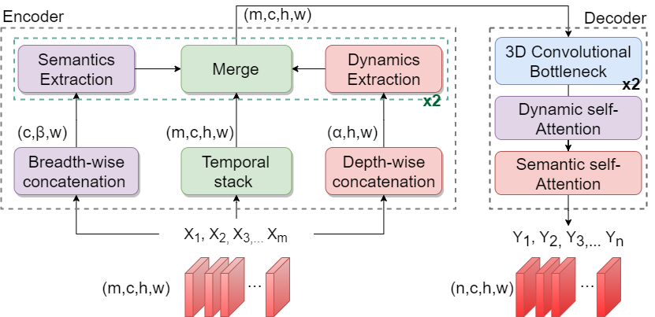

# Multi-axis Attentive Prediction for Sparse EventData: An Application to Crime Prediction


This repository is the official implementation of [Multi-axis Attentive Prediction for Sparse EventData: An Application to Crime Prediction
](https://arxiv.org/abs/2110.01794). 




## Data
The datasets used for this paper are public crime datasets:
 - [San Francisco (SF)](https://data.sfgov.org/Public-Safety/Police-Department-Incident-ReportsHistorical-2003/tmnf-yvry)
 - [Vancouver (VAN)](https://geodash.vpd.ca/opendata/)

## Pre-trained Models

You can download pretrained models here:

- [saved models](https://drive.google.com/drive/folders/1pWygcR5JDdoa-o9p9Qppsu52KYTPZJfI?usp=sharing) trained on SF and VAN public crime data. 


[comment]: <> (## Requirements)

[comment]: <> (To install requirements:)

[comment]: <> (```setup)

[comment]: <> (pip install -r requirements.txt)

[comment]: <> (```)

[comment]: <> (>📋  Describe how to set up the environment, e.g. pip/conda/docker commands, download datasets, etc...)

[comment]: <> (## Training)

[comment]: <> (To train the model&#40;s&#41; in the paper, run this command:)

[comment]: <> (```train)

[comment]: <> (python train.py --input-data <path_to_data> --alpha 10 --beta 20)

[comment]: <> (```)

[comment]: <> (>📋  Describe how to train the models, with example commands on how to train the models in your paper, including the full training procedure and appropriate hyperparameters.)

[comment]: <> (## Evaluation)

[comment]: <> (To evaluate my model on ImageNet, run:)

[comment]: <> (```eval)

[comment]: <> (python eval.py --model-file mymodel.pth --benchmark imagenet)

[comment]: <> (```)

[comment]: <> (>📋  Describe how to evaluate the trained models on benchmarks reported in the paper, give commands that produce the results &#40;section below&#41;.)


[comment]: <> (>📋  Give a link to where/how the pretrained models can be downloaded and how they were trained &#40;if applicable&#41;.  Alternatively you can have an additional column in your results table with a link to the models.)

[comment]: <> (## Results)

[comment]: <> (Our model achieves the following performance on :)

[comment]: <> (### [Image Classification on ImageNet]&#40;https://paperswithcode.com/sota/image-classification-on-imagenet&#41;)

[comment]: <> (| Model name         | Top 1 Accuracy  | Top 5 Accuracy |)

[comment]: <> (| ------------------ |---------------- | -------------- |)

[comment]: <> (| My awesome model   |     85%         |      95%       |)

[comment]: <> (>📋  Include a table of results from your paper, and link back to the leaderboard for clarity and context. If your main result is a figure, include that figure and link to the command or notebook to reproduce it. )


[comment]: <> (## Contributing)

[comment]: <> (>📋  Pick a licence and describe how to contribute to your code repository. )